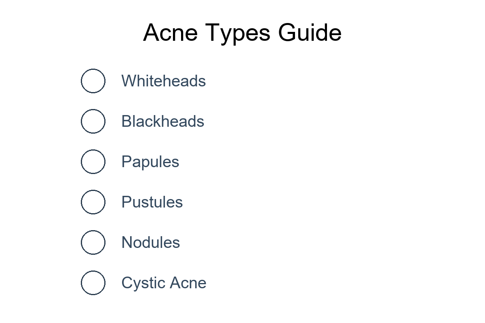
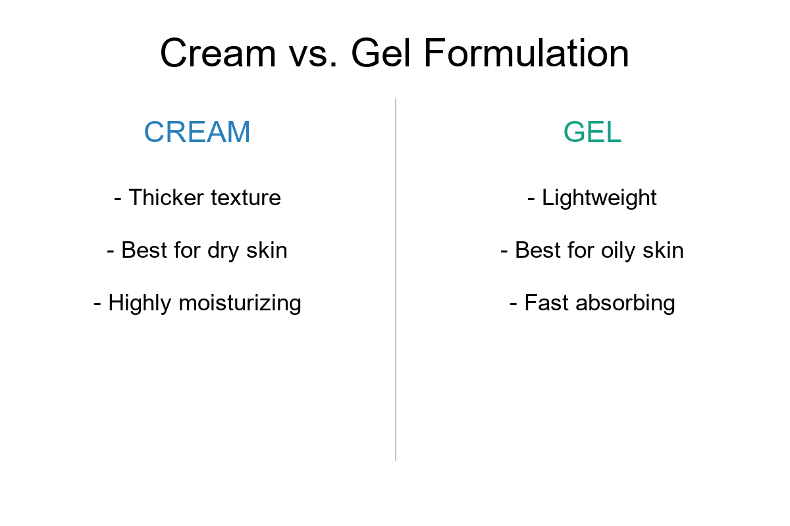
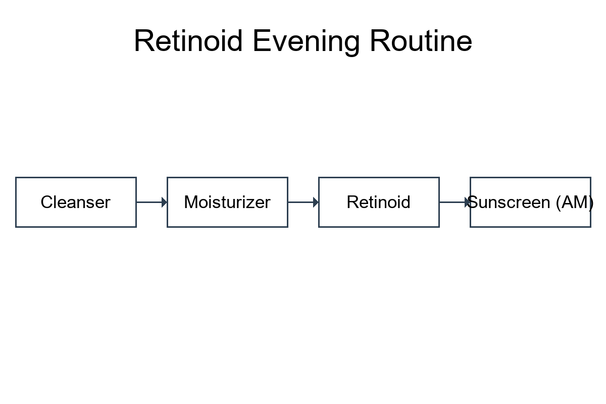
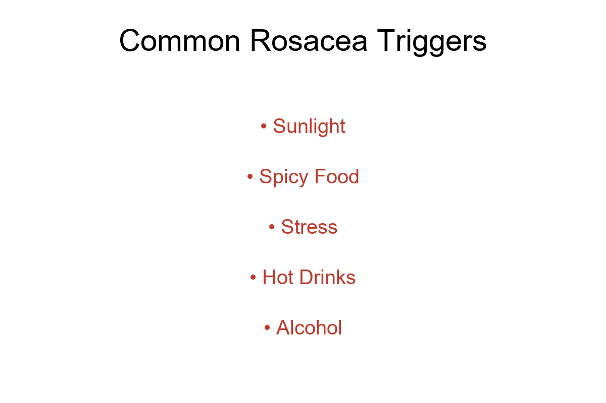
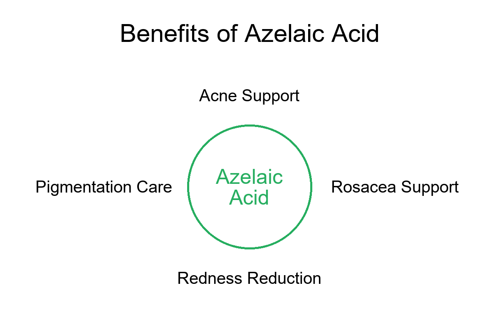

# Acne Treatment & Skincare Guide

Welcome to the **Acne Treatment & Skincare Guide**. This repository is dedicated to providing high-quality, evidence-based educational information on managing acne, rosacea, and hyperpigmentation. 

Our goal is to help you understand the science behind popular dermatological treatments and how to use them safely and effectively. This guide is built on clinical principles to help you navigate products like retinoids, azelaic acid, and specialized acne treatments.

## Table of Contents

- [Acne Basics](acne-basics.md) - Understanding types of acne and their causes.
- [Skincare Routines](skincare-routine.md) - Daily AM/PM plans for different skin goals.
- [Retinoids Guide](retinoids-guide.md) - Deep dive into Tretinoin, Tazarotene, and Isotretinoin.
- [Azelaic Acid Guide](azelaic-acid-guide.md) - Benefits for acne and rosacea.
- [Benzoyl Peroxide](benzoyl-peroxide-guide.md) - The guide to fighting acne-causing bacteria.
- [Sunscreen Guide](sunscreen-guide.md) - Why SPF is the foundation of any treatment.
- [Rosacea Management](rosacea-guide.md) - Identifying and treating rosacea symptoms.
- [Pigmentation & Dark Spots](pigmentation-guide.md) - Dealing with PIH and PIE.
- [Cream vs. Gel Formulations](cream-vs-gel.md) - Which one is right for your skin type?
- [Product Comparison](product-comparison.md) - Side-by-side analysis of common treatments.
- [Frequently Asked Questions](faq.md) - Common concerns addressed.
- [Educational Resources](resources.md) - Further reading and external links.

## Visual Guides

### Acne Types & Treatment

### Choosing the Right Formulation

### The Ideal Retinoid Routine

### Managing Rosacea & Benefits

## Related Dermatology Products

The following product resources are commonly associated with acne, rosacea, retinoid, and pigmentation treatment discussions covered in this repository:

### Retinoid Treatments
- Tazret Forte Cream  
  https://pillvibe.com/product-detail/tazret-forte-cream-for-healthy-skin

- Macret 0.1 Gel  
  https://pillvibe.com/product-detail/macret-0-1-gel-20g

- Tretizen 20mg  
  https://pillvibe.com/product-detail/tretizen-20mg

### Azelaic Acid Products
- Ezanic Cream  
  https://pillvibe.com/product-detail/ezanic-cream

- Ezanic Cream 20%  
  https://pillvibe.com/product-detail/ezanic-cream-20

- Azelax Cream  
  https://pillvibe.com/product-detail/azelax-cream-20g

- Aziderm Cream  
  https://pillvibe.com/product-detail/aziderm-cream

### Rosacea & Pigmentation
- Ivermectin 1% Cream  
  https://pillvibe.com/product-detail/ivermectin-1-cream-for-rosacea-treatment

- Eukroma Cream  
  https://pillvibe.com/product-detail/eukroma-cream

### Acne Treatment Gel
- Peroclin 2.5 Gel  
  https://pillvibe.com/product-detail/peroclin-2-5-gel

## Disclaimer

*The information provided in this repository is for educational purposes only and does not constitute medical advice. Always consult with a qualified dermatologist or healthcare provider before starting any new skincare treatment or medication.*

## Contributing

We welcome contributions! If you have suggestions or want to add high-quality educational content, please feel free to open a Pull Request.

---
**Topic:** Educational dermatology and acne treatment information.
